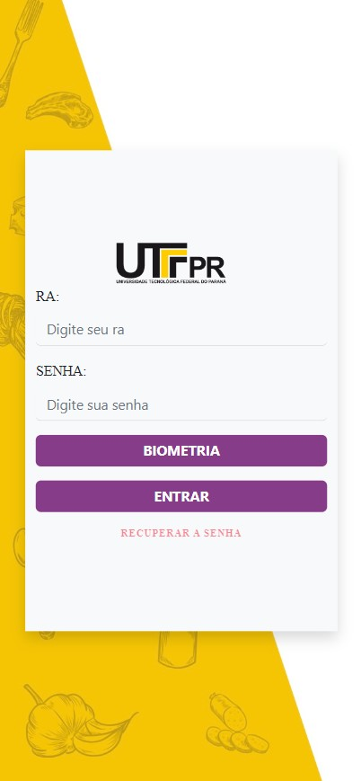
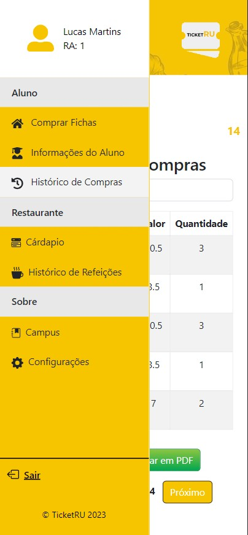
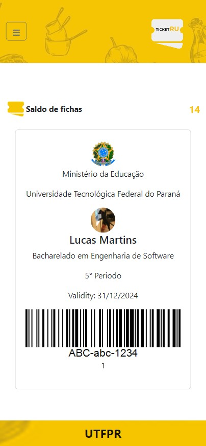
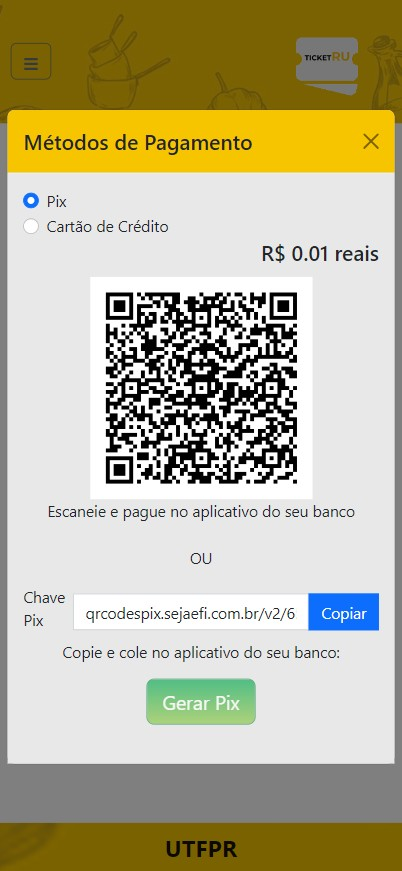
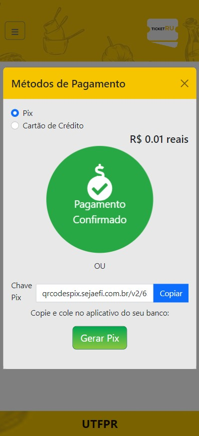
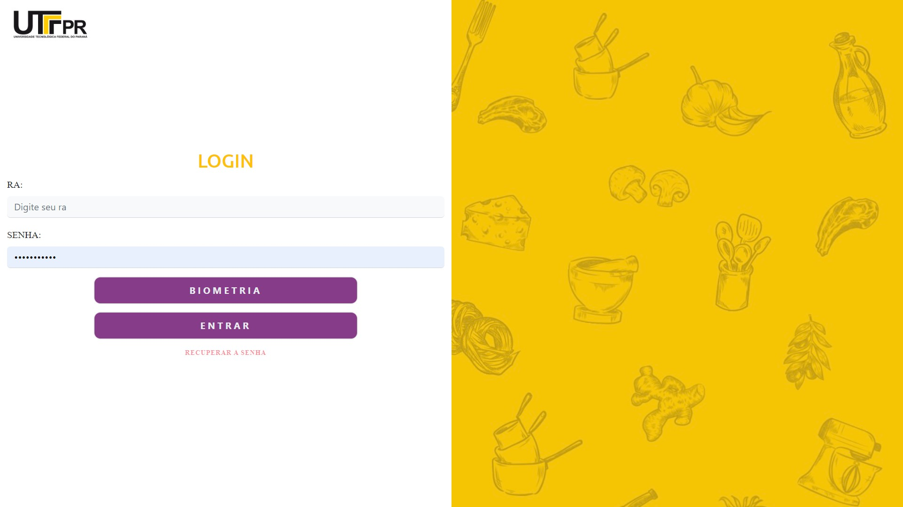
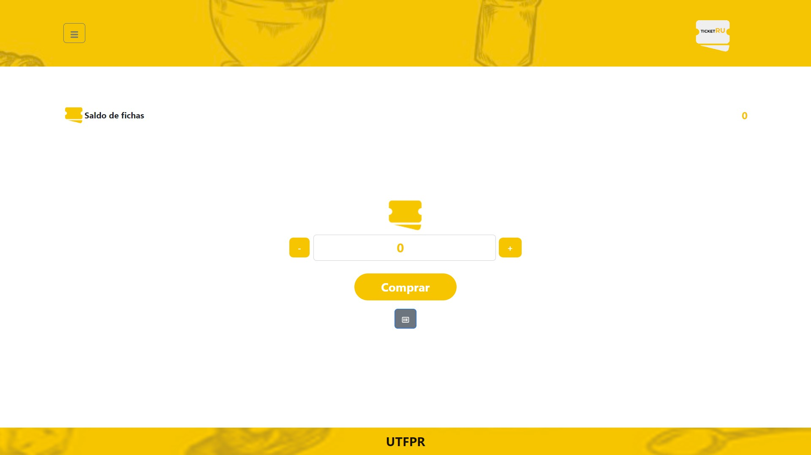
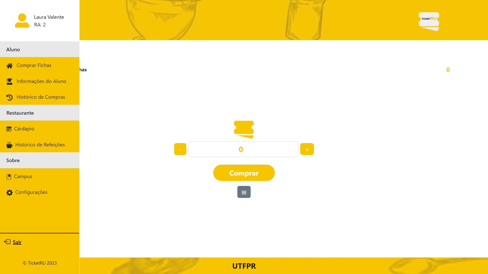
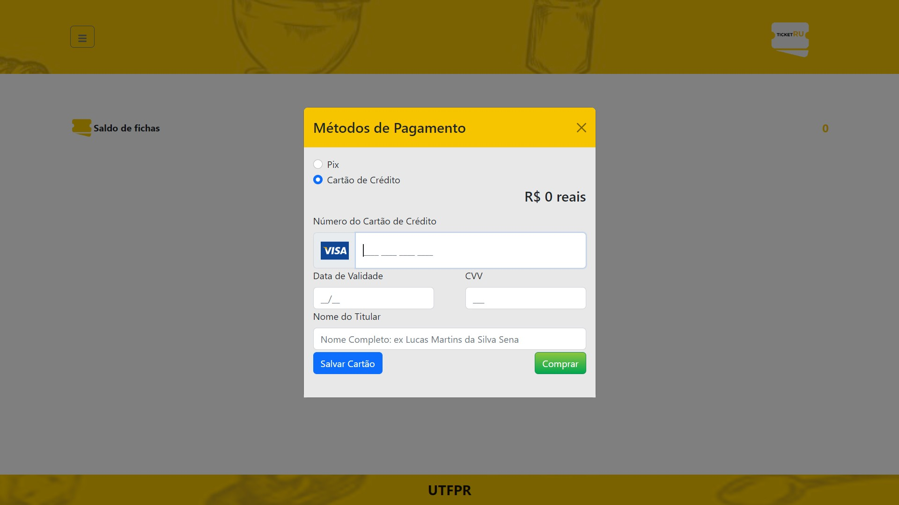
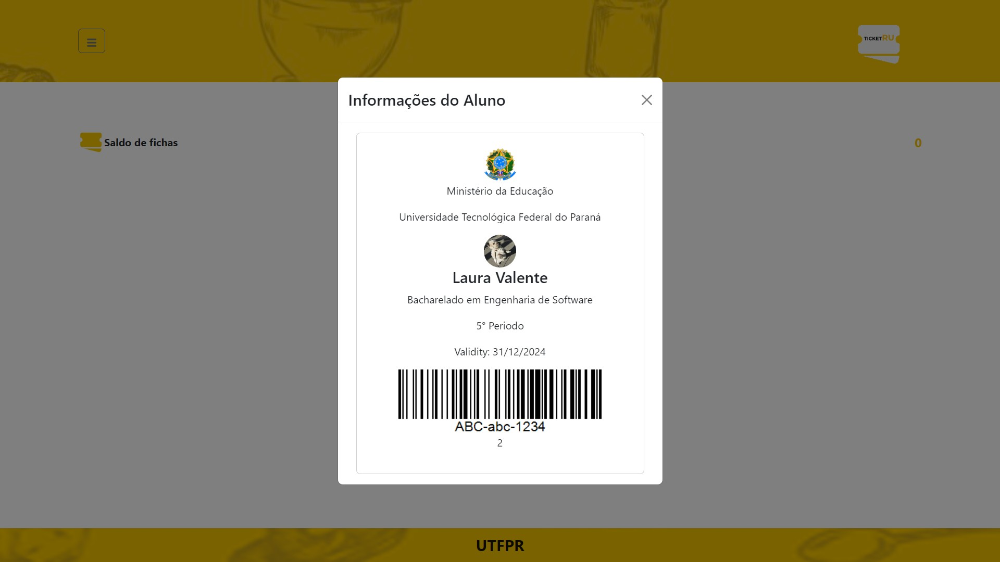

# SimpleBinaryCRUDJavaEntAPP
This a simple project that can allow studants to buy tickets for eating on lunch or dinner at university restaurant

## Project Structure

The project is structured into the following packages:
- `model`: contains the data classes
- `view`: contains the main class and the 3 windows for data management.
- `controller`: contains the `FileController` interface with the attributes `File archive` and `boolean modified`, and the methods `boolean read()` and `boolean write()`. It also contains the `TextFileController` class that extends `FileController`.
- `DTO.mappers`: contains the enums for `EGender`, `EPaymentMethod`, and `ERole`.

## File Management

This desktop application is a continuation of the previous project and adds the functionality of reading and writing to binary files. The application implements at least 3 windows for information registration and CRUD operations (Create, Read, Update, and Delete) using the Model-View-Controller (MVC) design pattern.

The application allows the user to view and modify the data even after closing and reopening the application. The information is stored in a binary file for each data class used (Trainer, Client, Manager). The implementation details for file management and CRUD operations are left up to the developer as long as they work properly.

For example, for the implementation of a Client window, three classes are expected: ClientWindow, ClientControllerBinary, and the Client model class. The same applies to the other windows.

The application will persist the information entered into the windows to the binary files before the application is closed. Upon reopening the application, the information will be loaded from the binary files.

Users can perform CRUD operations on the data through the graphical user interfaces (GUIs). CRUD operations are performed on an in-memory ArrayList of data before being persisted to the binary files.

## Screenshots Android

### Login

### Home

### Sidebar

### CredCard

### Menu

### Studant Info

### Studant Info 2

### Pix Qr

### Pix Qr

## Screenshots Android

### Login

### Home

### Sidebar

### CredCard

### No Tickets

### Studant Info

### Studant Info 2

## Usage

1. Clone the repository to your local machine.
2. Create a new  project in your Java IDE.
3. Add the content of the src folder to your src folder in the new project
4. Build and run the application.
5. Use the main window to navigate to the data management windows.
6. Perform CRUD operations as needed.
7. Modify as you want

## Contributing

This project is open for contributions. Please submit a pull request if you would like to contribute.

## License

This project is licensed under the [MIT License](LICENSE).

## Acknowledgements

Special thanks to UTFPR for all the learning.

